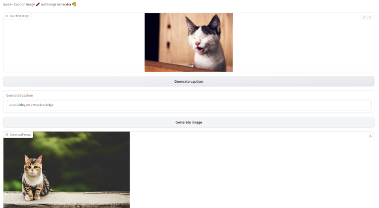

# Captioning4Generation
Caption image  and with that base generate new images (with stable diffusion and in gradio UI)

## 🤔 What is this?
**Description:**  
Are you ready for the game? to caption image  and with that base generate new images (with stable diffusion and in gradio UI)
-  Image Captioning with BLIP model
-  Image Generation with Stable Diffusion model

With gradio UI

## 📚 Data

YOu can import your own photos for the game.

##  🚀 Quick Install

Due to the power of GPU needed i advise you to use colab with `Captioning4Generation.ipynb`(in solution).

## 📖 Documentation / UI

🧮 **Captioning4Generation UI**: 

 

Please see the description in .ipynb about this project.
